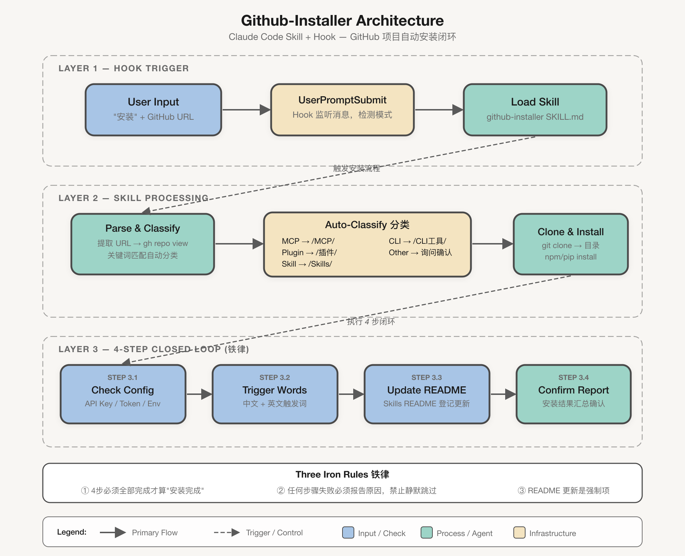

# Github-Installer

> *「每次都说下次不忘，每次都忘。」*

[](LICENSE)
[](https://claude.ai/code)
[](https://skills.sh)



我装了 30 多个 Claude Code 技能。每次装完都跟自己说"记得更新 README"。每次都没记。

直到有一天想找一个已安装的技能，翻遍 README —— 没记录。这技能什么时候装的？要不要配 API Key？触发词是什么？全不知道。

**Github-Installer 就是被这件事逼出来的。**

它不做安装这件事——`git clone` 谁都会。它做的是安装之后你总忘记的那四步：检查配置、分析触发词、更新 README、确认汇报。配合 Hook，你连"调用技能"都不用说，说"安装"就行。

[翻车现场](#翻车现场) · [安装](#安装) · [工作原理](#工作原理) · [English](#english)

---

## 翻车现场

### 😱 没有 Github-Installer 时

```
用户      ❯ 安装 https://github.com/xxx/some-skill

AI        ❯ 已克隆到社区技能目录，安装完成！
            （结束。没有检查配置，没有更新 README，没有分析触发词。）

--- 3 天后 ---

用户      ❯ 用 some-skill 帮我分析一下这个数据

AI        ❯ some-skill 需要配置 API_KEY 才能使用，请先设置环境变量。
            您没有安装这个技能。

用户      ❯ ？？？我三天前明明装了
```

装了 = 没装。因为没人检查配置、没人更新 README、没人记录触发词。

### ✅ 有了 Github-Installer 后

```
用户      ❯ 安装 https://github.com/xxx/some-skill

AI        ❯ 🔍 自动分类：社区技能
            📦 克隆 → 安装依赖 → 全局注册

            步骤 1/4：检查配置需求
            ⚠️ 需要 TAVILY_API_KEY（环境变量），请配置后使用

            步骤 2/4：分析触发词
            ✅ 「智能搜索」「tavily」「AI搜索」「网络搜索」

            步骤 3/4：更新 Skills README
            ✅ 已在速查表、全局技能表、新增记录表中登记

            步骤 4/4：确认汇报
            📦 Some-Skill（智能搜索工具）| ⭐ 1,234 | 社区技能
            📁 社区技能（网络下载）/some-skill_智能搜索工具
            ⚠️ 需要配置 TAVILY_API_KEY 环境变量

            ✅ 安装完成
```

**装完就是能用的。** 配置缺什么、触发词是什么、装在哪个目录，全在眼前。

---

## 安装

### 方式一：Skill + Hook（推荐）

**1. 安装 Skill**

```bash
cd ~/.claude/skills/
git clone https://github.com/JinHanAI/Github-Installer.git github-installer
```

**2. 配置 Hook**

Hook 监听你提交的每条消息。检测到"安装"+ GitHub URL 时，自动注入提示调用 Skill。
脚本已包含在仓库中，直接复制即可：

```bash
mkdir -p ~/.claude/hooks
cp github-installer/hooks/github-installer-trigger.sh ~/.claude/hooks/
chmod +x ~/.claude/hooks/github-installer-trigger.sh
```

在 `~/.claude/settings.json` 中添加：

```json
{
  "hooks": {
    "UserPromptSubmit": [
      {
        "hooks": [
          {
            "type": "command",
            "command": "/Users/YOUR_USERNAME/.claude/hooks/github-installer-trigger.sh"
          }
        ]
      }
    ]
  }
}
```

> 把 `YOUR_USERNAME` 替换成你的系统用户名。

**3. 自定义目录**

编辑 `SKILL.md` 中的分类表，将 `{Skills根目录}` 替换为你自己的目录结构。

### 方式二：只用 Skill（无 Hook）

```bash
cd ~/.claude/skills/
git clone https://github.com/JinHanAI/Github-Installer.git github-installer
```

没有 Hook 就不会自动触发，但对话中说 `github-installer` + GitHub URL 仍可手动调用。

---

## 工作原理

```
┌──────────────────────────────────────────────────────────┐
│                      用户提交 Prompt                       │
│              "安装 https://github.com/xxx/yyy"            │
└────────────────────────┬─────────────────────────────────┘
                         ▼
┌──────────────────────────────────────────────────────────┐
│              UserPromptSubmit Hook                        │
│         检测到 "安装" + "github.com"                      │
│         注入提示："请调用 github-installer 技能"            │
└────────────────────────┬─────────────────────────────────┘
                         ▼
┌──────────────────────────────────────────────────────────┐
│              github-installer Skill 加载                  │
│                                                          │
│   步骤 1：解析与分类                                      │
│   ├── 提取 GitHub URL                                    │
│   ├── gh repo view 获取项目信息                           │
│   └── 自动分类（MCP / 插件 / 技能 / CLI / 其他）          │
│                                                          │
│   步骤 2：克隆与安装                                      │
│   ├── 克隆到对应分类目录                                  │
│   ├── 安装依赖                                           │
│   └── 如果是 Skill → npx skills add 全局安装              │
│                                                          │
│   步骤 3：4 步闭环（铁律）                                │
│   ├── 3.1 检查配置需求（API Key / Token / 依赖）          │
│   ├── 3.2 分析触发词（中英文各至少一个）                   │
│   ├── 3.3 更新 Skills README（3 处登记）                  │
│   └── 3.4 确认汇报（摘要展示）                            │
└──────────────────────────────────────────────────────────┘
```

### 4 步闭环检查清单

| 步骤 | 做什么 | 为什么重要 |
|------|--------|-----------|
| **1. 检查配置** | 读取 SKILL.md，检查 API Key / Token / 环境变量 | 装了不能用，等于没装 |
| **2. 分析触发词** | 提炼 2-4 个触发词（中英文各至少一个） | 没触发词的技能是隐形技能 |
| **3. 更新 README** | 在 Skills 管理文档中 3 处登记 | 下次搜不到，等于不存在 |
| **4. 确认汇报** | 展示安装摘要：名称、分类、配置需求、触发词 | 让你知道装了什么、缺什么 |

### 自动分类

| 类型 | 判断关键词 | 安装位置 |
|------|-----------|---------|
| **MCP 服务器** | mcp, model context protocol | `{根目录}/MCP/` |
| **插件** | plugin, claude code plugin | `{根目录}/plugins/` |
| **技能** | skill | `{根目录}/Skills/` |
| **CLI 工具** | cli, command-line tool | `{根目录}/cli-tools/` |
| **其他** | — | 提醒用户确认 |

---

## 铁律

1. **4 步闭环必须全部完成才能说"安装完成"**
2. **任何步骤失败必须告知原因，不可静默跳过**
3. **README 更新是必选项，不是可选项**

---

## 依赖

- [Claude Code](https://docs.anthropic.com/en/docs/claude-code) CLI
- `gh` CLI — 获取 GitHub 项目信息
- `jq` — Hook 脚本中解析 JSON

---

## 仓库结构

```
Github-Installer/
├── SKILL.md                             # 技能定义（Claude Code 读取这个文件）
├── hooks/
│   └── github-installer-trigger.sh      # Hook 脚本（复制到 ~/.claude/hooks/ 即可）
├── architecture.png                    # 项目架构图
├── LICENSE                              # Apache 2.0
└── README.md                            # 你正在读的这个文件
```

---

## 许可证

Apache 2.0 — 随便用，随便改，保留署名即可。

---

## English

> *"Every time I tell myself I won't forget next time. Every time, I forget."*

I installed 30+ Claude Code skills. Every time I told myself "remember to update the README." Every time I forgot.

One day I needed a skill I'd installed days ago. Searched the README — no record. When was it installed? Does it need an API key? What are the trigger words? No idea.

**Github-Installer was born out of that frustration.**

It doesn't do the installation — `git clone` handles that. It does the 4 steps you always forget afterwards: check config, analyze triggers, update README, confirm report. With the Hook, you don't even need to say "invoke skill" — just say "安装" (install) and it kicks in.

### Before vs After

**Without Github-Installer:**
```
You: Install https://github.com/xxx/some-skill
AI:  Cloned and installed! ✅
     (No config check. No README update. No trigger words.)

--- 3 days later ---
You: Use some-skill to analyze this
AI:  some-skill requires API_KEY. Also, I don't see it installed.
You: ？？？ I literally installed it 3 days ago
```

Installed ≠ usable. Because nobody checked config, updated README, or recorded triggers.

**With Github-Installer:**
```
You: 安装 https://github.com/xxx/some-skill
AI:  🔍 Auto-classified: Community Skill
     📦 Clone → Install → Global register

     Step 1/4: Check config
     ⚠️ Requires TAVILY_API_KEY (env var)

     Step 2/4: Analyze triggers
     ✅ 「smart search」「tavily」「AI search」「web search」

     Step 3/4: Update Skills README
     ✅ Registered in 3 tables

     Step 4/4: Confirm report
     📦 Some-Skill | ⭐ 1,234 | Community Skill
     ⚠️ Needs TAVILY_API_KEY configured

     ✅ Install complete
```

**Installed = ready to use.** What's missing, what triggers it, where it lives — all visible.

### Install

```bash
cd ~/.claude/skills/
git clone https://github.com/JinHanAI/Github-Installer.git github-installer

# Set up Hook (recommended)
mkdir -p ~/.claude/hooks
cp github-installer/hooks/github-installer-trigger.sh ~/.claude/hooks/
chmod +x ~/.claude/hooks/github-installer-trigger.sh
```

Then add to `~/.claude/settings.json`:

```json
{
  "hooks": {
    "UserPromptSubmit": [
      {
        "hooks": [
          {
            "type": "command",
            "command": "/Users/YOUR_USERNAME/.claude/hooks/github-installer-trigger.sh"
          }
        ]
      }
    ]
  }
}
```

### The 3 iron rules

1. All 4 steps must complete before saying "done"
2. Any failure must be reported, never silently skipped
3. README update is mandatory, not optional

---

**Author:** Victor.Chen ([@AIJinHan](https://github.com/JinHanAI))

**License:** Apache 2.0
